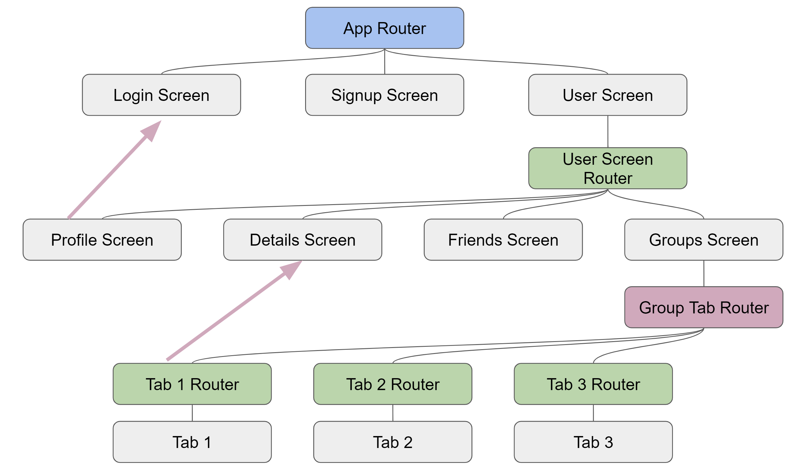

# Tutorial: Complex Flutter Navigation (Bottom bar and nested navigators) made easy with auto_route

A tutorial to show navigation in flutter using auto_route package
and a complex navigation that include nested routers and bottom bar router.
Updated, yet still `auto_route 2.0.x`.

- [Original project on GitHub](https://github.com/gbaccetta/flutter_navigation_tutorial)